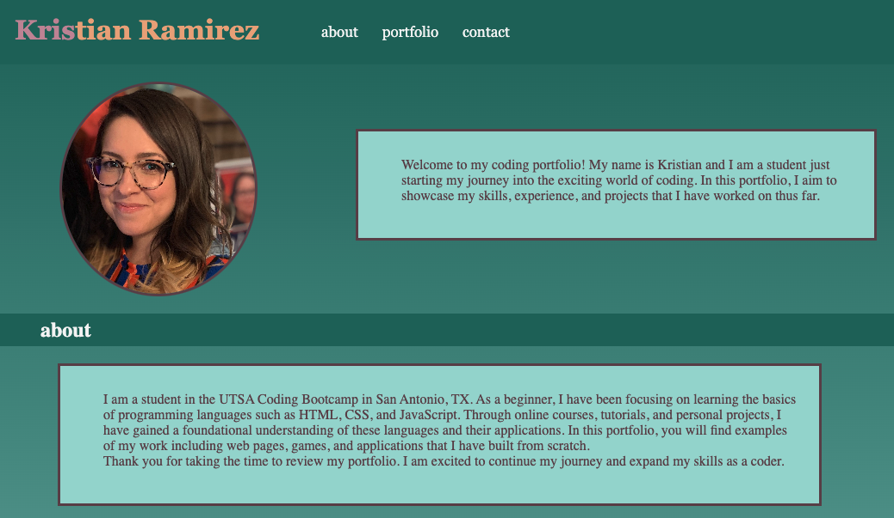

# Professional-Portfolio

# Advanced CSS Challenge: Professional Portfolio

# Description 

For this project, my goal was to create a portfolio showcasing my current work. In the future, I plan to add more projects that highlight a range of skills. As I develop new applications, I will include them in this portfolio along with my thought process for each one. I had a portfolio before this one, but I used a service instead of building it myself. By coding this portfolio with the CSS skills I've learned, I can see how much progress I've made as a student in a short period of time. During the project, I lost all of my code halfway through due to my own error. This experience taught me the importance of pushing my code to GitHub as frequently as possible.

## Installation

N/A

## Usage

This portfolio is meant to showcase applications I've created during the bootcamp. The portfolio section includes links to the applications when the images are clicked. You can also find more information about me and how to get in contact. 

Follow this link to see the portfolio: https://kris-ramirez.github.io/Professional-Portfolio/.

Below are screenshots of the final product:

## Credits

For this project I consulted the following webpages for tutorials:

https://www.w3schools.com/

https://stackoverflow.com/

As well as code from my previous applications which can be found here on my GitHub: https://github.com/kris-ramirez. 

## License

Please refer to the LICENSE in the repo. 
